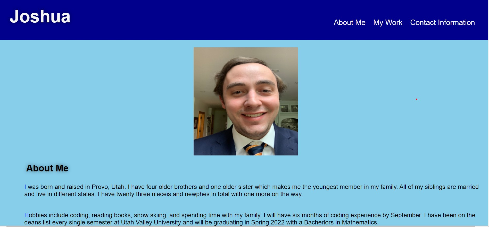

## Portfolio
Portoflio is my personal potfolio that talks a little about myself, highlights past projects I had done before starting the bootcamp and lists my personal contact informaiton.

## Assignment Tasks
1. create a Portfolio from scratch with no source code given
2. Portfolio needs to contain an picture of myself and links to sections about me, my work, and my contact information
3. The links in the navigation bar take me to that section on the webpage
4. The first image in my work section with the link to the application is bigger than the rest of the other applications
5. Clikcing on the images of the applications takes to the deployed application for that link
6. When the image is resized or set to different viewports it shows responsive design

## Tasks Achieved by
<ul> 
    <li>
    Revewing the lessons in module number 2
    </li>
    <li>
    Implementing the different tags I leanred to the HTML file and CSS stylesheet
    </li>
    <li>
    Using flex prpoperities along with media queries and pseudo elements
    </li>
    <li>
    following the acceptance criteria
    </li>
</ul>

## Link to Website
<a href="https://joker282855.github.io/Portfolio/">Portfolio Website</a>

## Screenshot of Website

## Built With
<ul>
    <li>
    HTML
    </li>
    <li>
    CSS
    </li>
    <li>
    Advanced CSS
    </li>
</ul>

## Contributors
Made with ❤️ by Josh Jackson